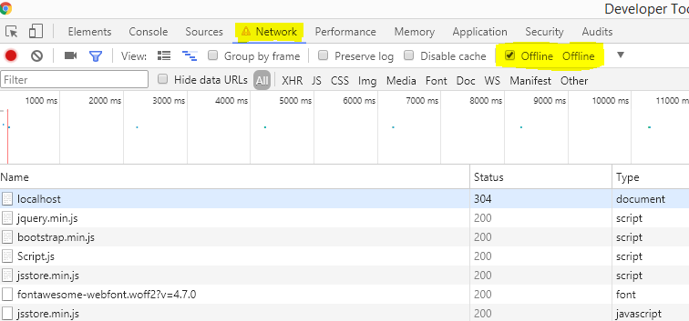

# Chat Room Demo

This is a demo to show how offline app can be made simply with [JsStore][l_jsstore].
	
## Overview

In Chat Room Demo, The messages sent or received are stored locally in indexedDB using [JsStore][l_jsstore] and synced with the server in each request.

If the  user is offline or server is not responding, the messages are stored locally and these failed messages are pushed to server and 
new messages are fetched from the server whenever user goes online or server starts responding.

Two new things are introduced in this demo which you should know:

* [JsStore][l_jsstore]:
It is an IndexedDB Wrapper. It makes IndexedDB super easy with its SQL like apis.

* [Json-server][l_jsonserver]:
It provides API for CRUD operation on any json file(say db.json) which contains the data(like a Database) It run on node.js.

## Installation

### 1. Install node.js

If node.js is not installed in your system then you can get it from [here][l_nodejs].
	
### 2. Clone/download the ChatRoomDemo

### 3. Install Package
Open the Node.js command prompt and go to the directory(ChatRoomDemo) which contains `package.json` file
 then enter the command below
	
```bash
$ npm install 
```

This command will install the required modules for this demo.

### 4. Start the json-server and http-server

Open the Node.js command prompt and go to the directory(ChatRoomDemo) which contains the `db.json` file. Once you are pointing to the ChatRoomDemo directory in Node.js command prompt, enter the command below
	
```bash
$ npm start
```
	
## Ready to go

The site will be hosted at  http://localhost:8080.
Now you can start playing with this demo by going offline and online from the `Network` tab of Browser Developer tool

	
[l_nodejs]: <https://nodejs.org/en/download>
[l_jsonserver]: <https://github.com/typicode/json-server>
[l_jsstore]: <http://www.jsstore.net>
